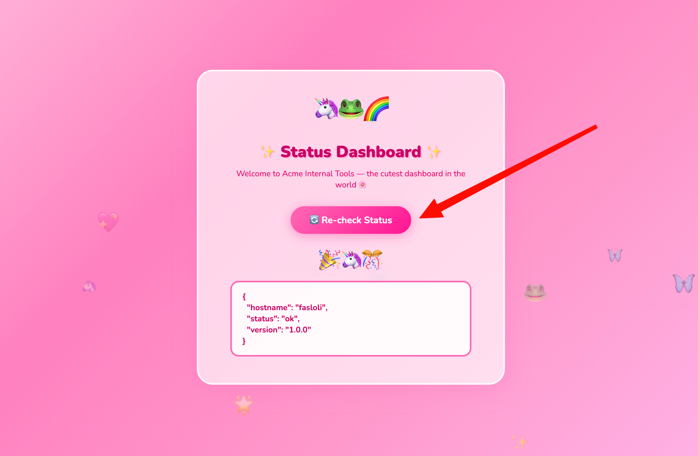

# Status Dashboard

A cute little internal status dashboard for Acme Internal Tools.

## What is this?

A Flask web app that shows the health of your service. It runs inside Docker, with nginx sitting in front as a reverse proxy.

## Quick Start

Clone the repo and run the install script with `sudo` (it needs root to install packages and configure nginx):

```bash
git clone https://github.com/fasloli/acme-status-dashboard.git
cd acme-status-dashboard
sudo API_KEY=<your-secret-key> ./install.sh
```

The `API_KEY` is a password that protects the `/api/v1/secret` endpoint. Pick whatever you want - just remember it for later.

That's it! Open `http://<your-server-ip>/` in your browser.

## How to Use

When you open the dashboard, click the **Check Status** button:



You'll see the service status with hostname and version info. Click **Re-check Status** anytime to refresh:


## API Endpoints

| Method | Path | What it does |
|--------|------|--------------|
| GET | `/` | The dashboard UI |
| GET | `/api/status` | Returns service status as JSON |
| GET | `/api/v1/status` | Returns service status as JSON |
| GET | `/api/v1/secret` | Returns a secret (needs `X-API-Key` header) |

## Testing with curl

```bash
# Check status
curl -s http://localhost/api/status | jq .

# Try the secret endpoint (should get 401)
curl -s -o /dev/null -w "%{http_code}\n" http://localhost/api/secret

# Access the secret with your key
curl -s -H "X-API-Key: <your-secret-key>" http://localhost/api/secret | jq .
```

## Environment Variables

| Variable | Required | Default | Description |
|----------|----------|---------|-------------|
| `API_KEY` | Yes | - | Key for the secret endpoint |
| `VERSION` | No | `1.0.0` | Version shown in status response |
| `PORT` | No | `5000` | Port the Flask app listens on |

## Architecture

```
Browser (port 80) → nginx → Docker container (port 5000) → Flask app
```

- **nginx** listens on port 80 and forwards requests to the container
- **Docker** runs the app isolated on 127.0.0.1:5000
- **Flask** handles the requests and returns responses
